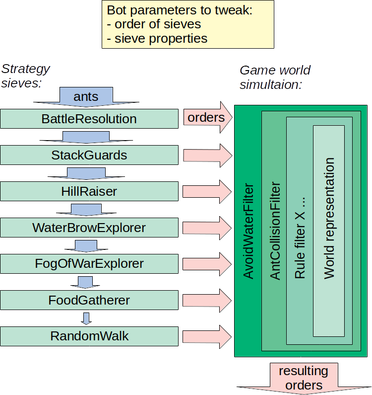

# Jockbert ants bot

Bot in the game [Ants AI Challenge](http://ants.aichallenge.org/).

## Rough architecture




## Future improvements roadmap
1. Fix new "ordered into water" bug
1. Implement ant-on-ant-battle strategy.
1. Fix shortfall introduced to HillRaiser strategy, only rasing hills of player 2.
1. Improve multisearch so several ants can go to same target - useful for raising hills.
1. Remember food/hills/opponents etc. in fog of war.
1. Reuse old search paths if no new obstacle are in the way.
1. Iterative search length cutoff, first iteration using Manhattan. End before timeout.
1. Extract to run strategies on other thread.
1. Parallelize the search effort - use multiple threads.

## Changes up to 2020-04-06
1. Add ASCII-art serialization of agent world step state. Serialization of state is useful as start state for hunting bugs via debugging and test cases.
1. Fix old bug where RandomWalk strategy thows when there are no legal direction to move to.

## Changes up to 2020-02-16
1. Fix food planning bug: Should prioritize neares food instead of the one first in the food-list. - Solved by implementing multisearch, a heuristic to priotitize among several search results.
1. Extract comonalities from different strategies to a "strategy tool" - reduced lines of code.

## Changes up to 2019-11-17
* "Multiple A*" in search when finding food. For single search start position, reuses partial results for next search target.
* Add strategy SpreadOutScout, taking precedence over RandomWalk. It uses a low resolusion grid spreading over he entire map, as ant targets.
* Add strategy HillRaiser, using enemy hills as ant targets.

```
        Current strategy stack
        1. HillRaiser
        2. GatherFood
        3. SpreadOutScout
        4. RandomWalk
```

## Older changes up to 2019-10-03

* Add Breadth-first-search for finding parths from one start position and several targets.
* Add RandomWalk strategy.
* Add GatherFood strategy.
* Add Searck length cut off limit in search.
* Add AvoidWater filter when enumerating possible ant orders.
